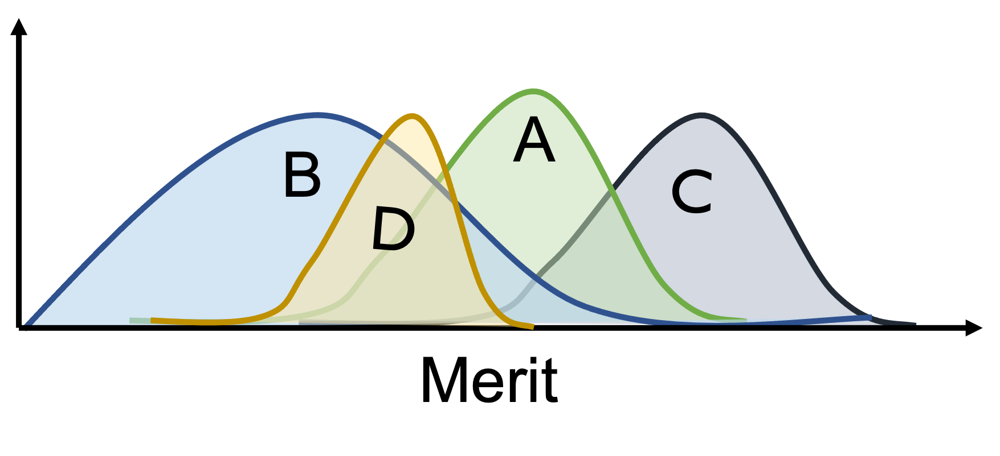

# Fairness in Ranking under Uncertainty

This repository is the official implementation of the NeurIPS 2021 paper[Fairness in Ranking under Uncertainty](https://arxiv.org/abs/2107.06720). 

{ width: 200px; }

## Requirements

To install requirements:

```setup
pip install -r requirements.txt
```

## Dataset

In the paper, we present two sets of experiments -- a simulation based on the Movielens dataset, and a real-world paper recommender system run at KDD 2020.

The dataset may be downloaded from the [MovieLens website](https://files.grouplens.org/datasets/movielens/ml-latest-small.zip), and unzipped in the subdirectory 'ml-latest-small'.

The details of the KDD recommender system experiment are shared in the kdd-experiment subdirectory.

## Running the experiments

To run the experiments, simply follow the steps as shown in the jupyter notebook 'movielens-ranking-fairness-uncertainty.ipynb'.

The notebook uses the library which contains the following files:

- preprocess_movielens_dataset.py: Provides functionality to load and preprocess the movielens dataset as described in the paper.
- linear_program.py: Provides necessary functions to transform the ranking problem to the linear program that can be solved by an off-the-shelf LP solver.
- sample_rankings.py: Provides utility functions to work with ranking distributions.
- plot_utils.py: Utility functions to plot the graphs and visualizations shown below.
-requirements.txt: To be able to run the code, these requirements must be installed. The jupyter notebook also requires a latex installation to be able to use math fonts inside the plots. If it does not work for you, please change the line with plt.rcParams['text.usetex'] from True to False.

Jupyter Notebooks:

- suboptimal-OPT-TS-mix.ipynb: Notebook with the example showing how OPT/TS mixing ranking policy can be suboptimal in terms of utility while the LP based ranking policy achieves optimal utility.
- movielens-ranking-fairness-uncertainty.ipynb: Notebook with the movielens experiments.

## Contributing

This project is licensed under the terms of the MIT license.
